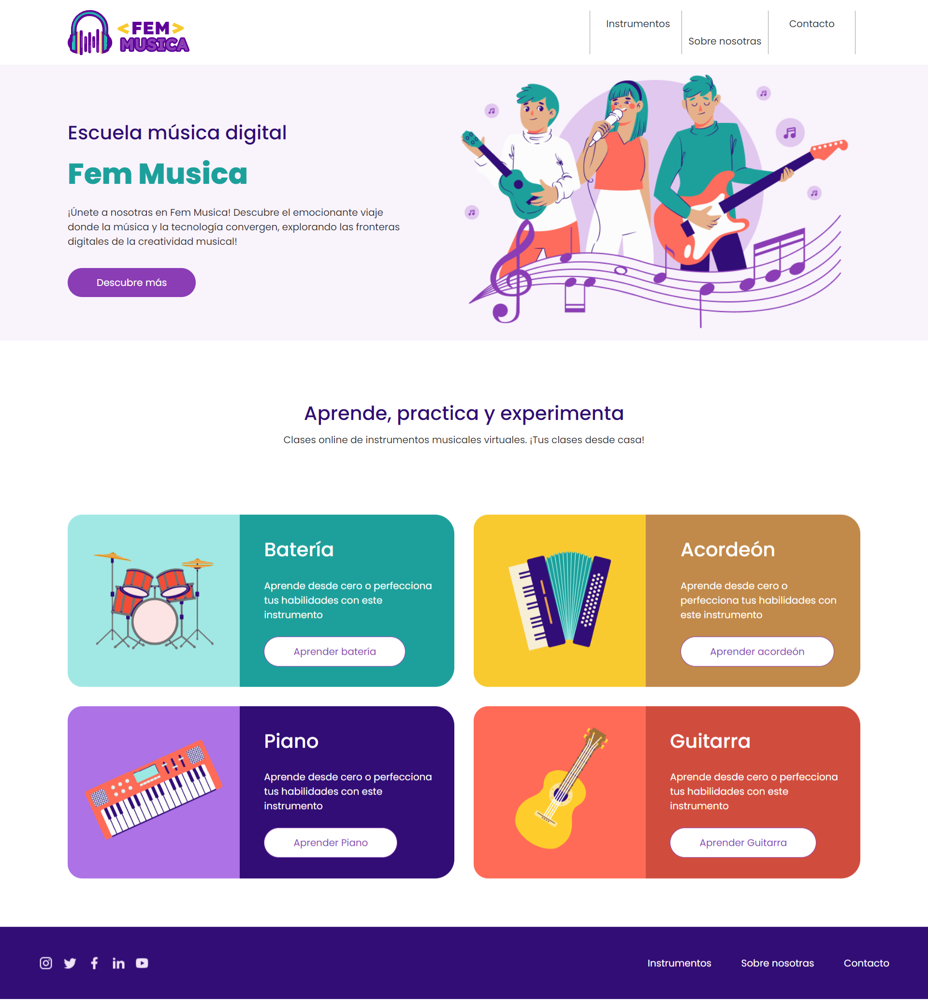

# 🖥️ Fem Musica - Escuela de Música Virtual 🎵
¡Bienvenidas a Fem Musica, la escuela donde la música y la tecnología convergen! Únete a nosotras y descubre el emocionante viaje explorando las fronteras digitales de la creatividad musical. 🚀 En Fem Musica, enseñamos a tocar instrumentos, siendo la batería nuestro instrumento virtual estrella 🥁. Puedes tocar la batería haciendo clic en los elementos de esta o utilizando el teclado, el cual será manipulado mediante eventos al DOM.


### 🌈 Tecnologías Empleadas 

- HTML: La base, como el escenario para nuestro espectáculo musical.
- CSS: ¡Vistamos nuestro concierto con los colores más vibrantes!
- JavaScript: El director de la orquesta, haciendo magia en el DOM.

### 📌 Requisitos para el Funcionamiento Actual 
- Visual Studio Code

### 💿 Instalación del Repositorio

1. Clona este repositorio.
```

git clone https://github.com/annaLucian/toquen-el-dom

```
2. Ejecuta index.html en tu navegador preferido.


🎤 ¡Sube al Escenario!

Por favor sientete libre de explorar nuestra aplicación virtual y toca la batería con clics o el poder del teclado.

### 🎵 Pruebas con Ritmo

¡Queremos pruebas con buen ritmo! Usamos Vitest para asegurarnos de que todo funcione como una melodía perfecta

1.Para poder ejecutar los test has de tener instalado Node.js. Versión LTS.
Puedes comprobar que lo tienes instalado con el comando:
```

node -v

```

4.Una vez instalado Node.js, instala las dependencias necesarias:
```

npm install

```

5-Ejecuta las pruebas utilizando Vitest
```

npm run test

```
o
```

npm test

```

### 🎵 Imagenes de la web




### 🎉 Contribuye con Fem Musica

1. Haz un fork del repositorio.

2. Clona tu fork localmente.

```

git clone https://github.com/tuusuario/fem-musica.git

```
3. Crea una rama para tus contribuciones.
4. Realiza tus cambios y asegúrate de que las pruebas sean un concierto sin desafines.

## 🌟 Desarrolladoras Estelares

🎸 Débora Menezes: 

[](https://www.linkedin.com/in/d%C3%A9bora-sofia-menezes/) 

🎤 Vicky Roberson : 

[](https://www.linkedin.com/in/gabriela-poves-navarro/)

🎹 Rosalia Bravo: 

[](https://www.linkedin.com/in/rosalia-bravo-valencia-a6618b34/)

🥁 Stefania Desogus: 

[](https://www.linkedin.com/in/stefaniadesogus/)

🎻 Gabriela Poves: 

[](https://es.linkedin.com/in/danicp)

¡Gracias por unirte a Fem Musica, donde la magia del código encuentra su ritmo y el DOM se convierte en una bateria virtual! 🎶
